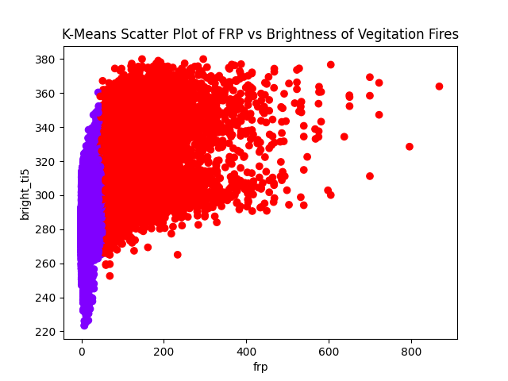

# AWISSA Experiments

Goal: To find a two variables that exhibit clustering and use those clusters (by means of cluster analysis) to differentiate vegitation fires from wildfires.

Note: All data will filter out points marked by VIRRS data as low confidence under the "confidence" attribute.

[VIRRS data attributes](https://www.earthdata.nasa.gov/learn/find-data/near-real-time/firms/vnp14imgtdlnrt#ed-viirs-375m-attributes)

1. The K-means algorithim is an unsupervised learning method used to identify clusters of data points. K-means clustering into two clusters on a graph of frp and bright_ti5 is shown below:

Doesn't seem to be a clear clustering comparing the variables frp (Fire Radiative Power) and bright_ti5.